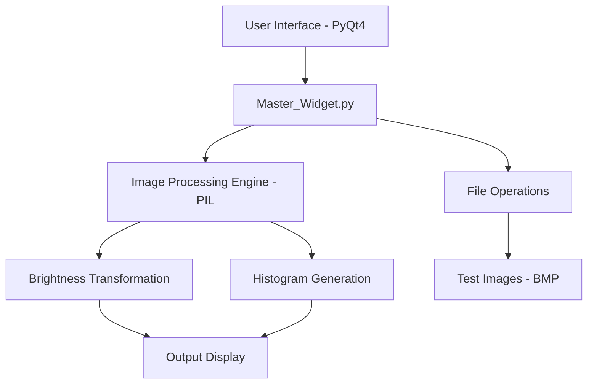

# Image Processing System

A legacy Python application for image analysis and basic processing, featuring real-time histogram calculation and brightness adjustment.

## Table of Contents
- [Introduction](#introduction)
- [Features](#features)
- [System Architecture](#system-architecture)
- [Installation](#installation)
- [Usage](#usage)
- [Project Structure](#project-structure)
- [Technical Details](#technical-details)
- [License](#license)

---

## Introduction
The **Image Processing System** (v1.1) is a tool designed for analyzing the brightness distribution of images. It provides a side-by-side comparison of the original and processed images along with their respective histograms.

> **Note:** This is a legacy project built with Python 2.7 and PyQt4.

## Features
| Feature | Description |
| :--- | :--- |
| **Image Loading** | Supports various formats (BMP, PNG, JPG) via PyQt4's image reader. |
| **Invert Pixels** | Flips pixel colors (j = 255 - i) using built-in Qt methods. |
| **Brightness Adjustment** | Real-time adjustment using a slider (-255 to +255) powered by PIL. |
| **Histogram Visualization** | Generates and displays grayscale histograms for both input and output. |
| **Zoom** | Digital zoom for detailed image inspection. |

## System Architecture



## Installation
To run this application, you need a legacy environment:

1. **Python 2.7**
2. **PyQt4**
3. **Pillow** (PIL fork)

```bash
# Example installation for legacy systems
pip install Pillow
# PyQt4 usually requires system-level installation (e.g., apt-get install python-qt4)
```

## Usage
1. Run the application:
   ```bash
   python Master_Widget.py
   ```
2. Click on **Plik -> Otwórz plik** to load an image from `Test_Images/`.
3. Use the **Regulacja Jasności** slider to see real-time changes in the output image and its histogram.
4. Access **Edycja obrazu -> Odwróć piksele** to invert colors.

### Code Example: Brightness Transformation
The core transformation logic uses PIL's `point` method:
```python
def transformImage(self, pil_image):
    # Adjusts every pixel by the slider value
    self.transformed_image = self.pil_image.point(lambda i: i + self.sld.value())
    # Convert back to Qt format for display...
```

## Project Structure
- `Master_Widget.py`: Main application logic and UI.
- `Program_Images/`: Icons and UI assets.
- `Test_Images/`: Sample BMP files for testing.
- `README.md`: This documentation.

## Technical Details
- **Version:** 1.1
- **Developer:** Agnieszka Szypuła
- **Backend:** PIL (Python Imaging Library)
- **GUI:** PyQt4 (Qt version 4.x)
